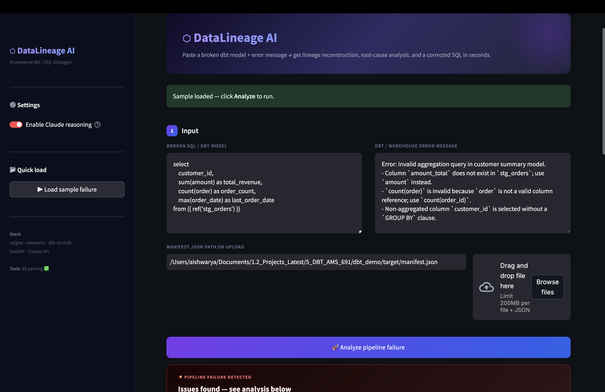
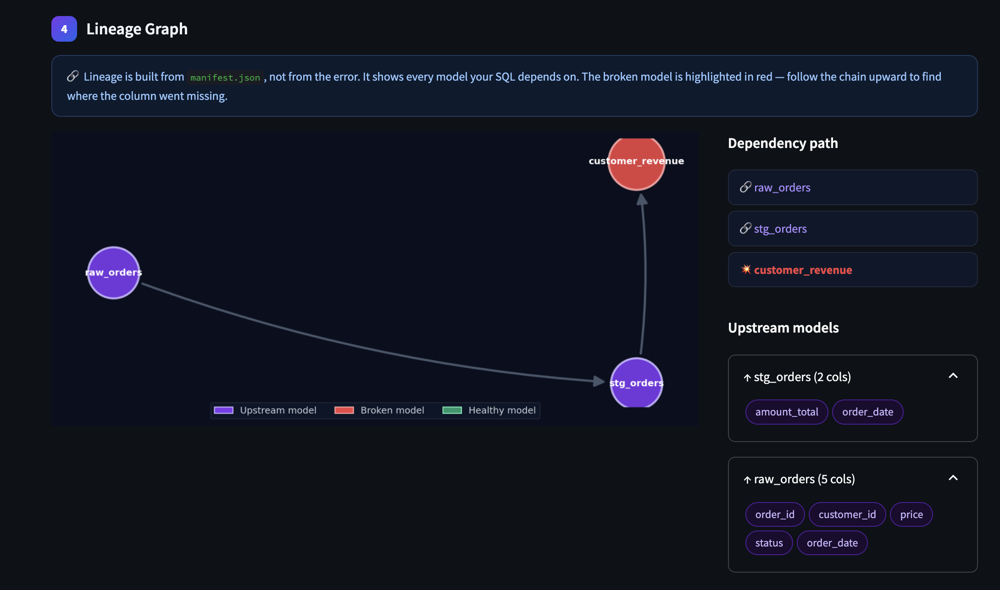
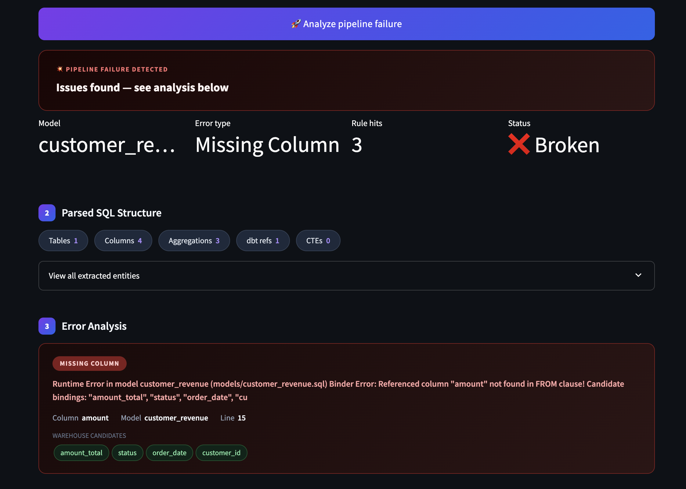
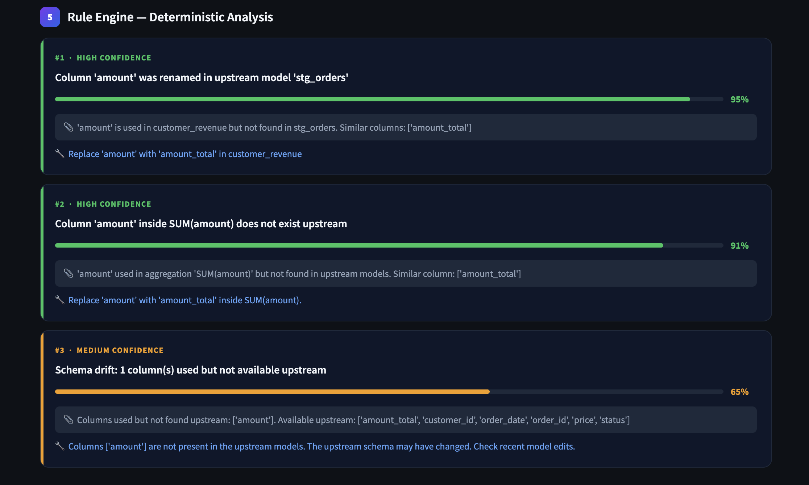
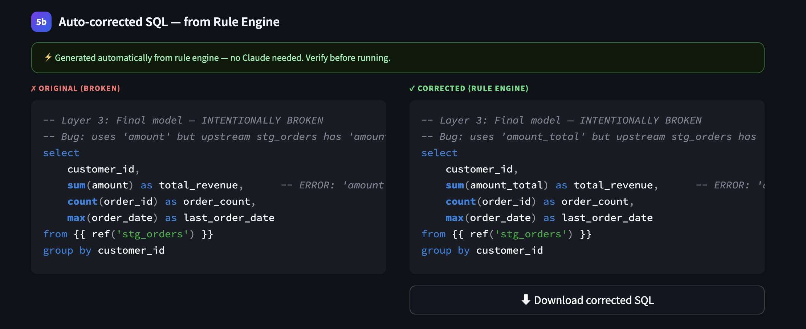
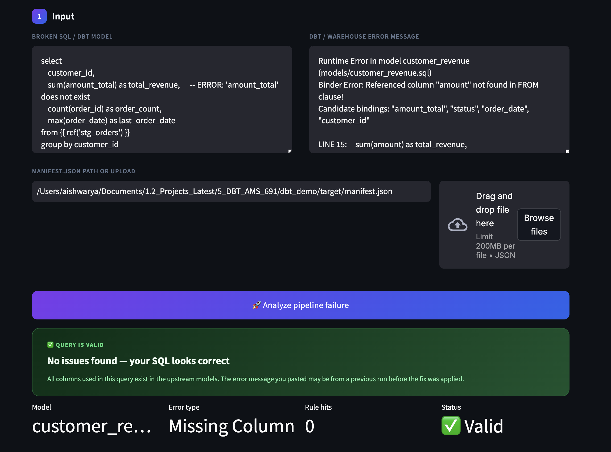

# DataLineage AI - Multi-Agent SQL & dbt Pipeline Debugger

> **Project** · Aishwarya Bhanage · Stony Brook University

An AI-powered debugger that ingests broken SQL/dbt models and error messages, reconstructs pipeline lineage, and outputs confidence-scored root causes with corrected queries - cutting debug time from hours to minutes.

---

## Problem

Data engineers and analysts still play **pipeline detective** when SQL/dbt jobs fail. Existing tools surface errors but rarely identify the true upstream cause, forcing manual lineage tracing and trial-and-error fixes - resulting in slower debugging, broken dashboards, and unreliable pipelines.

---

## Solution

A multi-agent AI debugger that:

1. **Parses** the broken SQL and extracts all entities (tables, columns, joins, aggregations)
2. **Traces** upstream/downstream lineage from `manifest.json`
3. **Reasons** deterministically about root causes using a rule engine
4. **Fixes** the query automatically — and calls Claude for plain-English explanation when available

---

## Demo

### 1 — Input screen

Paste a broken SQL model + error message, provide the `manifest.json` path or upload it. Click **▶ Load sample failure** in the sidebar to auto-fill a realistic broken dbt model.



---

### 2 — Lineage Graph

The pipeline DAG rebuilt from `manifest.json`. Broken model highlighted in red — trace upstream to find where the column went missing.



---

### 3 — Error Analysis

All sub-errors parsed individually into typed cards — model name, column, line number, and warehouse candidate columns shown.



---

### 4 — Rule Engine — Deterministic Analysis

Confidence-ranked root-cause hits with evidence and exact fix hints — no LLM required.



---

### 5 — Valid Query Detection

When the SQL is already correct, the system detects no issues and shows a green "Query is valid" banner.



---

### 6 — Auto-corrected SQL

Side-by-side diff of original vs corrected SQL, generated automatically by the rule engine. Download button included.



---

## Architecture

```
User Input  (broken SQL + error message + manifest.json)
      │
      ▼
┌─────────────────────────────────────────────────────┐
│                   debug_pipeline.py                  │
│                                                      │
│  sql_parser.py       →  tables, columns, aggs, CTEs  │
│  manifest_loader.py  →  model nodes, dependencies    │
│  lineage_builder.py  →  upstream/downstream DAG      │
│  error_parser.py     →  normalize all sub-errors     │
│  rule_engine.py      →  deterministic root causes    │
│  llm_service.py      →  Claude reasoning + fix       │
└─────────────────────────────────────────────────────┘
      │
      ▼
   Streamlit UI  (FastAPI also available at /analyze)
```

### Agents / Modules

| Module | Role |
|--------|------|
| **SQL Parser** (`sqlglot`) | Extracts tables, columns, joins, filters, CTEs, aggregations, dbt refs |
| **Manifest Loader** | Reads `dbt manifest.json`, maps model names → deps → columns |
| **Lineage Builder** (`networkx`) | Reconstructs upstream/downstream DAG, finds impacted nodes |
| **Error Parser** | Splits multi-error messages into typed sub-errors (missing column, missing GROUP BY, etc.) |
| **Rule Engine** | Deterministic checks: column rename, invalid agg column, missing GROUP BY, broken ref, type mismatch |
| **LLM Service** | Claude API — ranks hypotheses, explains root cause, generates corrected SQL + validation checklist |

---

## Tech Stack

| Layer | Tool |
|-------|------|
| SQL parsing | `sqlglot` |
| Lineage graph | `networkx` |
| dbt metadata | `manifest.json` (dbt compile output) |
| LLM reasoning | Claude API (`claude-sonnet-4-6`) |
| Backend API | FastAPI |
| Frontend | Streamlit |
| Local dbt | `dbt-core` + `dbt-duckdb` |
| Testing | `pytest` (60 tests) |

---

## Project Structure

```
data-lineage-ai/
├── app/
│   ├── api/
│   │   └── main.py              # FastAPI — POST /analyze
│   ├── core/
│   │   ├── config.py            # env var loading
│   │   └── schemas.py           # Pydantic models
│   ├── services/
│   │   ├── sql_parser.py        # sqlglot extraction
│   │   ├── manifest_loader.py   # dbt manifest reader
│   │   ├── lineage_builder.py   # networkx DAG
│   │   ├── error_parser.py      # multi-error parsing
│   │   ├── rule_engine.py       # deterministic rules + SQL auto-fix
│   │   └── llm_service.py       # Claude API integration
│   ├── workflows/
│   │   └── debug_pipeline.py    # orchestrates all modules
│   └── ui/
│       └── streamlit_app.py     # Streamlit frontend
│
├── dbt_demo/                    # sample dbt project (DuckDB)
│   ├── models/
│   │   ├── raw_orders.sql       # source model
│   │   ├── stg_orders.sql       # staging model
│   │   └── customer_revenue.sql # intentionally broken model
│   └── dbt_project.yml
│
├── data/
│   ├── sample_errors/           # example error messages
│   └── sample_manifests/        # example manifest.json
│
├── screenshots/                 # app screenshots
├── tests/                       # 60 pytest unit tests
├── requirements.txt
└── .env                         # ANTHROPIC_API_KEY (not committed)
```

---

## Quickstart

### 1. Clone & install

```bash
git clone https://github.com/AishwaryaBhanage/DataLineage-AI-Multi-Agent-SQL-and-dbt-Pipeline-Debugger.git
cd DataLineage-AI-Multi-Agent-SQL-and-dbt-Pipeline-Debugger

python3 -m venv venv && source venv/bin/activate
pip install -r requirements.txt
```

### 2. Add your API key (optional — app works without it)

```bash
echo "ANTHROPIC_API_KEY=your_key_here" > .env
```

### 3. Generate the sample manifest

```bash
cd dbt_demo
dbt compile --profiles-dir .
cd ..
```

### 4. Run the app

```bash
streamlit run app/ui/streamlit_app.py
# Opens at http://localhost:8501
```

### 5. Run tests

```bash
python -m pytest tests/ -v
```

---

## How It Works — Step by Step

### Input

The user provides three things:
- **Broken SQL / dbt model** — the SQL that failed
- **Error message** — from the warehouse or dbt logs
- **`manifest.json`** — generated by `dbt compile`, contains full lineage metadata

### Pipeline

```
1. Parse SQL        → extract all entities with sqlglot
2. Parse error      → split multi-error messages into typed sub-errors
3. Detect model     → find the broken model using manifest downstream lookup
4. Build lineage    → reconstruct DAG from manifest dependencies
5. Run rules        → deterministic checks for 6 common error types
6. Auto-fix SQL     → apply rule hits to generate corrected query
7. Call Claude      → rank causes, explain, validate (requires API key)
```

### Supported Error Types

| Error | Rule | Example |
|-------|------|---------|
| Missing column | Fuzzy-match against upstream columns | `amount` → `amount_total` |
| Column renamed upstream | Levenshtein similarity search | `order_amt` → `order_amount` |
| Invalid agg column | Check column inside `SUM/COUNT/AVG` exists upstream | `COUNT(order)` → `COUNT(order_id)` |
| Missing GROUP BY | Detect non-aggregated columns alongside aggregations | Add `GROUP BY customer_id` |
| Broken ref | Check `ref()` names against manifest node list | Typo in model name |
| Relation missing | Check source/model existence in manifest | Missing upstream model |

---

## Sample Broken dbt Model

```sql
-- models/customer_revenue.sql  (broken)
select
    customer_id,
    sum(amount_total) as total_revenue,
    count(order) as order_count,       -- ❌ should be order_id
    max(order_date) as last_order_date
from {{ ref('stg_orders') }}
-- ❌ missing GROUP BY customer_id
```

**Error message:**
```
Runtime Error: Invalid aggregation query in customer summary model.
- count(order) is invalid because order is not a valid column reference; use count(order_id).
- Non-aggregated column customer_id is selected without a GROUP BY clause.
```

**Auto-corrected output:**
```sql
select
    customer_id,
    sum(amount_total) as total_revenue,
    count(order_id) as order_count,    -- ✅ fixed
    max(order_date) as last_order_date
from {{ ref('stg_orders') }}
group by customer_id                   -- ✅ added
```

---

## What Claude Does vs What Code Does

| Layer | Responsibility |
|-------|---------------|
| **Code (deterministic)** | SQL parsing, manifest loading, lineage traversal, schema matching, rule-based checks, auto-fix generation |
| **Claude (LLM)** | Ranking hypotheses, plain-English explanation, corrected SQL formatting, validation checklist, impact summary |

The rule engine always runs. Claude is additive — the app is fully functional without it.

---

## User Flow

```
Upload broken SQL + error  →  Parse  →  Trace lineage  →  Reason  →  Fix  →  Show result
```

Goal: reduce Mean Time to Resolution (MTTR) for data pipeline failures.

---

## Tests

```
60 tests · 4 test files
├── test_sql_parser.py          # sqlglot extraction
├── test_manifest_and_lineage.py # manifest loading + DAG traversal
├── test_error_and_rules.py      # error parsing + all rule types
└── test_pipeline.py             # end-to-end pipeline integration
```

Run with:
```bash
python -m pytest tests/ -v
```

---

## Future Improvements

- [ ] LangGraph multi-agent orchestration (Parser → Lineage → Reasoner → Fix nodes)
- [ ] FAISS / Chroma vector search over historical fixes
- [ ] AWS S3 manifest ingestion + RDS results storage
- [ ] Slack / PagerDuty alert integration
- [ ] Support for Snowflake, BigQuery, Redshift schema metadata
- [ ] Automated dbt test generation for the corrected model
